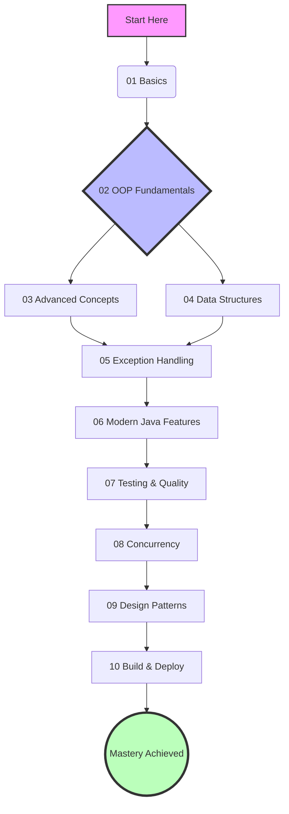

# ☕ Java & OOP Mastery: From Zero to Hero

```text
       _  _____      ___      
      | |/ _ \ \    / / |     
      | | |_| \ \  / /| |_    
  _   | |  _  |\ \/ / |  _|   
 | |__| | | | | \  /  | |__   
  \____/|_| |_|  \/   |____|  
  OBJECT ORIENTED PROGRAMMING
```

> **Stop memorizing syntax. Start thinking in Objects.**  
> This repository is not just a code dump. It is a structured, hands-on curriculum designed to take you from writing "Hello World" to architecting robust, scalable software using industry-standard Data Structures and Design Patterns.

---

## 🗺️ The Learning Path



---

## 🎓 Syllabus

Designed to be consumed in order. Each folder contains a detailed **Lesson Plan (README)**, **Refactored Examples**, and a **Challenge**.

| Icon | Module | Key Concepts Covered | Difficulty |
| :---: | :--- | :--- | :---: |
| ☕ | **[01-Basics](./01-Basics)** | Syntax, Variables, Loops, Control Flow, `Scanner` | 🟢 Beginner |
| 🧩 | **[02-OOP-Fundamentals](./02-OOP-Fundamentals)** | Classes, Objectives, Inheritance, Polymorphism, Encapsulation | 🟡 Intermediate |
| 🚀 | **[03-Advanced-Concepts](./03-Advanced-Concepts)** | Packages, File I/O, Serialization, Swing GUI | 🟠 Advanced |
| 📚 | **[04-Data-Structures](./04-Data-Structures)** | Arrays, ArrayLists, Big O Notation, HashSet | 🟠 Advanced |
| 🛡️ | **[05-Exception-Handling](./05-Exception-Handling)** | Try-Catch-Finally, Custom Exceptions, Best Practices | 🔴 Expert |
| 🔮 | **[06-Modern-Java-Features](./06-Modern-Java-Features)** | Records, Switch Expressions, Text Blocks, Sealed Classes | 🟣 Expert |
| 🧪 | **[07-Testing-And-Quality](./07-Testing-And-Quality)** | JUnit 5, Mockito, SLF4J Mocking | 🔴 Professional |
| ⚡ | **[08-Concurrency-Performance](./08-Concurrency-Performance)** | Threads, Executors, Async, Virtual Threads (Java 21) | 🔴 Professional |
| 🏗️ | **[09-Design-Patterns](./09-Design-Patterns)** | Singleton, Factory, Strategy, Adapter | ⚫ Architect |
| 🚢 | **[10-Build-And-Deploy](./10-Build-And-Deploy)** | Maven, Docker, JAR Manifests | ⚫ Architect |

---

## ✨ Features

* **Real-World Scenarios**: No more "Foo Bar". We build **ATMs**, **Bank Systems**, **RPGs**, and **MP3 Players**.
* **Industry Standards**: All code is refactored to clean code standards (CamelCase, meaningful comments).
* **Interview Prep**: Each module includes common interview questions used by top tech companies.
* **Interactive Challenges**: tough "Homework" assignments in every folder to test your skills (with Acceptance Criteria).

---

## 🚀 How to Use

1. **Clone the Repo**:

    ```bash
    git clone https://github.com/yourusername/java-oop-mastery.git
    ```

2. **Navigate to a Module**:
    Start with `01-Basics`. Read the `README.md` inside that folder.
3. **Run the Examples**:
    Open the file in VS Code or IntelliJ. Run the `.java` file to see how it works.
4. **Complete the Challenge**:
    Open `Challenge.md` in the folder. Write your own solution to the prompt.

---

## 🤝 Contribution

Found a bug? Want to add a new Design Pattern?  
We welcome contributions! Please fork the repo and fix it.

1. Fork the Project
2. Create your Feature Branch (`git checkout -b feature/AmazingFeature`)
3. Commit your Changes (`git commit -m 'Add some AmazingFeature'`)
4. Push to the Branch (`git push origin feature/AmazingFeature`)
5. Open a Pull Request

---

*Made with ❤️ by your Fellow Learner.*
